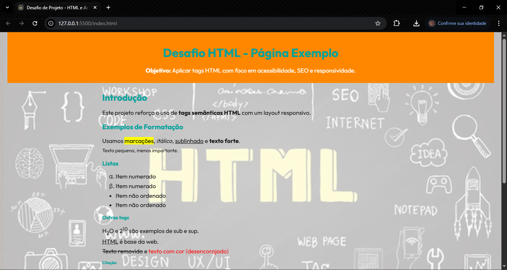

# Dio-Bootcamp-Santander-Front_End-LP_Tags_Website
Este projeto é uma como parte do Dio Bootcamp Santnader-Front_End e tem como objetivo o desenvolvimento de uma landingPage de website com tag's básicas de HTML. 

### 📜 Sobre o Projeto

O objetivo deste projeto é desenvolver uma página com a utilização das tag´s básicas:

 - explicadas nas aulas: h1 até h6, p, mark, small, i, u, strong, ol, ul, li, a, hr, sub, sup, blockquote.
 - novas tags sugeridas: font, del, p, abbr (a ideia é buscar estas tags na internet, entender como ela funciona e utilizar no texto).

### 🔗 Links Úteis

- 

- 

### ✅ Status do Projeto

**Em Desenvolvimento**

### 🎥 Deploy

#### Tela da Página do Pokedex

  

#### Tela da Página com Resultado da lista de Pokémons

  

#### Tela da Página de detalhes do Pokémon

  

#### Tela da Página com o resultado da busca por Pokémon (apenas faz a busca pelos cards da lista)

  

#### Tela do código da LP_Tags_Website

  

### 🧩 Desafio

### 📝 Requisitos da Aplicação

| Item  | Descrição                                                                       |
|-------|---------------------------------------------------------------------------------|
|  1    | A página deve ser desenvolvida em HTML, CSS                                     |
|  2    | Modelagem do layout, formatos, tipografias, cores e organização livre.          |
|  3    |       |
|  4    |       |
|  5    |       |
|  XX   |       |

### 🚀 Plano do Projeto

No desenvolvimento desta página, foram aplicados os seguintes conceitos:

| Item  | Descrição                                   |
|-------|---------------------------------------------|
|  1    | HTML                                        |
|  2    | CSS                                         |

### 🛠 Tecnologias Utilizadas

- **Visual Studio Code**
- **HTML**
- **CSS**
- **Documentação**
- **ChatGpt**

### 💡 Reflexões

Desenvolver este projeto foi um aprendizado na programação, permitindo um aprofundamento prático nas técnicas de desenvolvimento web.

### 📦 Como Executar o Projeto

1. Clone o repositório:
   
    git clone 

3. Abra o projeto no Visual Studio Code e ative o Go Live:
    
   

     
   

   

     
   

4. Visualize o resultado na página web:

   

     
   

### 🙋‍♂️ Autor
Ricardo Werner 
Dev. em Desenvolvimento
